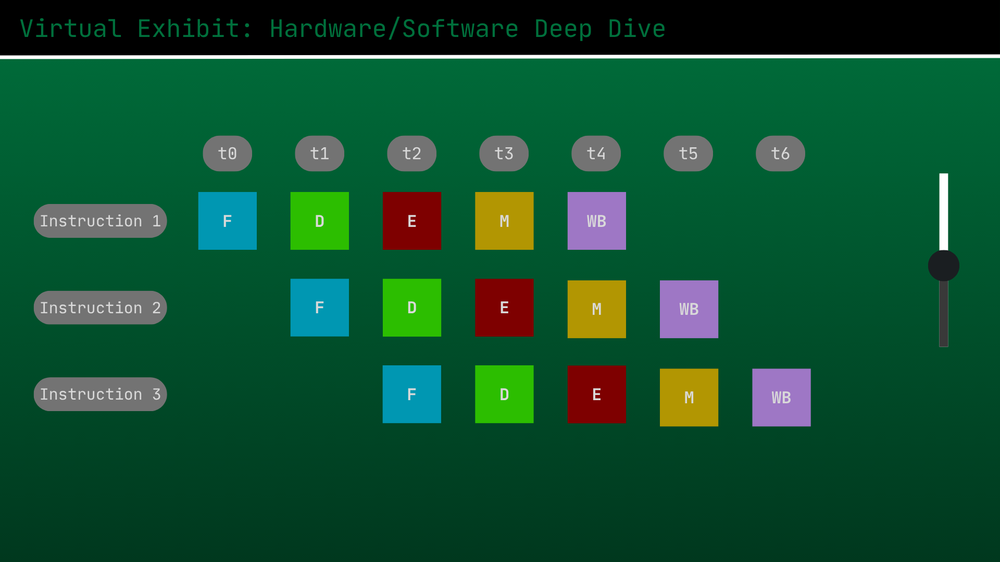
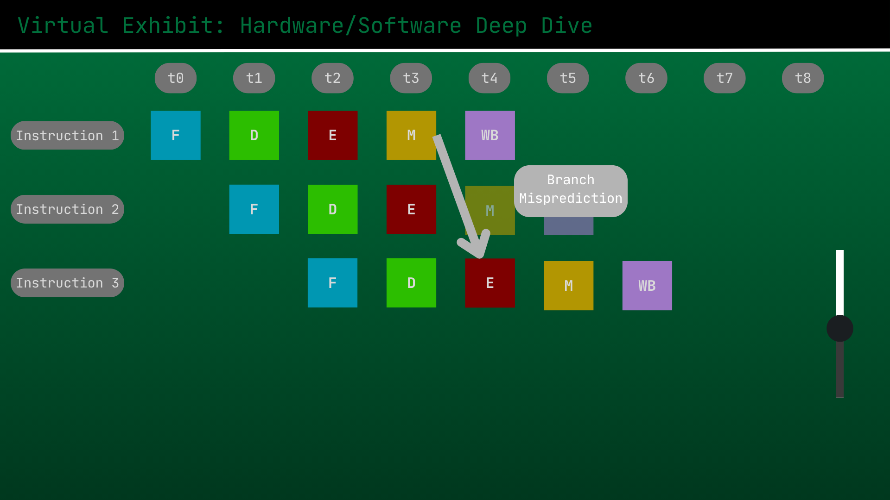
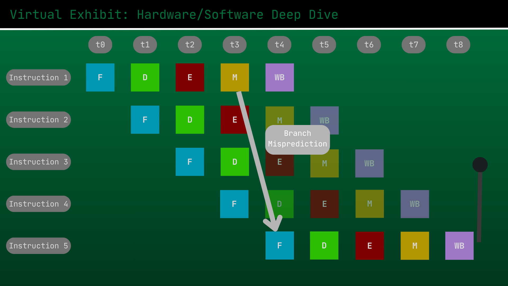

# A Deep Dive into Instruction Level Parallelism - The Foundation of Fast Processors

Group 4 - S01

- HIZON, Allen Conner C.
- INFANTE, Charles Sebastian V.
- MARQUEZ, Jose Miguel S.
- SY, Justin John Abraham F.
- TENORIO, Jeroen Ralph I.

---

## Proposal Revisions

### Previous Feedback

```
Topic disapproved.

1.) Topic should be related to computer architecture.  The proposed topic is a purely a Computer Network topic.

2.) No GitHub submission.  Setup the GitHub.  Proposal documents part of the incremental readme.

Alternative:

*Wifi evolution
*mobile network evolution
```

### Key Changes Made

- **Topic Change:** Previous proposed topic of Password Life Cycle got rejected and changed to Instruction-Level Pipelining
- **Tentative Style Change:** Mockup images changed to be less "slide-like" and focus more on the mockup for the simulation + interactive element (user slider)

## 1. Topic Theme

### An in-depth dive into Instruction-Level Parallelism and Pipelining

This topic explores the concept of Instruction-Level Parallelism (ILP) in CPUs, which is one of the core concepts behind making fast processors by allowing them to execute multiple instructions simultaneously. The deep dive starts by explaining ILP and its necessity for CPUs, noting how it is a concept every modern processor is designed around.

The exhibit then focuses on the implementation of **pipelining**, the primary method for achieving ILP in CPUs. Through its interactive simulation of pipelining, the users will be able to visualize instruction execution both before and after pipelining is implemented, enabling them to understand the necessity of the technique. Besides this, the exhibit will also contain simulations for common pipelining hazards – it will show data and branch hazards, along with the techniques used to address them such as pipeline flushes and stalls.

## 2. Interactive Element

The primary interactive element is a simulation of CPU instruction pipelining. The exhibit will first display CPUs executing instructions without pipelining, showing how the full fetch, decode, execute, write-back cycle gets executed for every instruction sequentially. A slider is provided allowing the user to increase the number of instructions and see the corresponding increase in time for the simulation to complete.

Then, the simulation will provide the option to enable pipelining. It will demonstrate visually how the instructions get executed in parallel, with different instructions in different stages as the CPU executes them simultaneously. The slider will enable the user to see how despite the same increase in load, the CPU maintains faster execution speeds this time through pipelining.

The simulation will then allow the user to simulate pipelining hazard scenarios such as branch hazards and data hazards, explaining how they occur and visualizing the process. Then, the simulation will also give the user the opportunity to utilize techniques such as pipeline flushing and pipeline stalling to avoid these hazard scenarios, with the time cost of both techniques properly visualized.

## 3. Tech Stack Plan

| Component | Technology | Application & Justification |
| :---- | :---- | :---- |
| Runtime | Node.js | Running Astro and building tools. |
| Framework | Astro 6 | Main framework for building the virtual exhibit website. |
| Content | MDX | Allows writing content in Markdown while embedding interactive React components directly into the text. |
| UI Components | React & TypeScript | Manages the complex, dynamic state of the interactive branch prediction simulator. |
| Styling | Tailwind CSS | Handles mobile-responsive UI and hardware-themed styling via utility classes. |

## 4. Tentative Style

### Mobile-responsive layout

The website will be usable and responsive on mobile devices due to the lack of advanced features that would necessitate a desktop device. There will be no intensive calculations on the client side, and the layout of the simulation and controls can easily be adjusted to accommodate for mobile devices given the chosen technologies like Tailwind CSS and React.


These two mockup images illustrate the simulation of instruction execution without pipelining. The slider adjusts the number of instructions, and the simulation would display the corresponding time it takes to execute all instructions one after the other.  



These two mockup images illustrate the simulation of instruction execution with pipelining. The slider still adjusts the number of instructions, and the simulation would display how the CPU executes pipelined instructions much faster in parallel.



These two mockup images illustrate the CPU’s handling of a branch misprediction scenario through a pipeline flush. The user would be able to simulate a branch misprediction and view how the corresponding flush causes the remaining instructions to be cleared out.  


The last mockup image shows a simulation of the CPU performing a pipeline stall in order to avoid a data hazard when an instruction is dependent on a previous one. The user is able to choose where the simulated data hazard happens and is able to see the corresponding pipeline stall that enables the operation to complete before the dependent instruction is executed.

## Website Development Section

Incremental readme - document your development (things done) in the readme (aha moments, things learned, challenges, creative development, etc) as well as things to be done on the final submission. Those documents should be part of the incremental readme (new document on top of the previous proposal document).

### Phase 1: Completed Development & Implementation

- **Visual Design (`pipeline-theme.css`)**: Built a customized legacy BIOS dark navy/neon cyan style, with scanline gradients and specialized responsive layout adjustments.
- **Core Engine (`PipelineGrid.tsx` & `pipelineUtils.ts`)**: Built a central presentational grid component to render clock cycle tables and support responsive overlays.
- **Interactive Simulations**:
  - **Sequential Sim (`SequentialSim.tsx`)**: Visualizes non-pipelined sequential execution (20% hardware unit utilization).
  - **Pipelined Sim (`PipelinedSim.tsx`)**: Demonstrates staggering and dynamic speedup ratio tracking (up to 3x speedup and 100% hardware unit utilization).
  - **Hazard Flush Sim (`HazardFlushSim.tsx`)**: Traces branch mispredictions with flushing shakes, NOP injections, and animated redirection arrows.
  - **Hazard Stall Sim (`HazardStallSim.tsx`)**: Models data dependencies, stalls (cloud bubbles), and optimized bypass data forwarding paths.
- **MDX Integration (`pipelining.mdx`)**: Fully updated all content text with detailed academic descriptions, references, and visual embeds.

### Challenges & AHA! Moments

- **The Browser Auto-Zoom Bug (Challenge)**: While adjusting instruction counts, the grid columns grew larger. Under default flexbox properties, children have `min-width: auto`, which forced the entire simulator box to expand beyond the viewport. The browser responded by automatically zooming the entire page to fit the wide layout, making elements shrink and causing a jarring user experience.
- **The Constrained Layout (AHA! Moment)**: Applying `min-width: 0` and `max-width: 100%` on the scrollable container (`.ps-grid-scroll`), coupled with `max-width: 100%; overflow: hidden;` on the flex wrapper (`.ps-grid-wrapper`), successfully bounded the layouts. The grid tables now scroll smoothly inside their containers instead of resizing the entire website.
- **2000 Pixels of Instructions (Challenge)**: For the first interactive element meant to show the time requirements of non-pipelined execution, the original layout made it go up to 8 instructions and consequently take over 2000 pixels horizontally.
- **Doing Too Much (AHA! Moment)**: To fix that, we simply toned down the interactive element to a maximum of 4 instructions. It still illustrates the point well enough without becoming overbearing to the point where the rest of the website layout suffers.

### Things to Be Done for the Final Submission

As it is, we believe the Virtual Exhibit satisfies all the given requirements. Proper website layout, complete and correct technical contents with trusted references, READMe documentation of the exhibit and process, complete interactive elements, and the disclosure of AI usage. Before the final submission, we shall review the technical content and simulations to see if anything could be refined or expanded, but for the mid-milestone submission, we believe the website is complete and will require minimal, if any, changes for the final submission.

### Feedback Received before Final Submission

```
1.) suggest for web: scaling the horizontal to fit the screen.  Currently has horizontal overflow.

2.) Separate data hazard with branch hazard.  You can approach me for technical detail

3.) Keep improving the web contents and interactive elements of your web apps.
```

### Final Submission Additions and Revisions

- **Hazard Simulations (`HazardForwardingSim.tsx`, `HazardNoForwardingSim.tsx`, `HazardLoadUseSim.tsx`)**: Created simulations for Data Hazards showing how the CPU handles them both with and without forwarding, along with a simulation of a Load-Use hazard to showcase the limitations of forwarding.
- **Horizontal Overflow Fix (`SequentialSim.tsx`)**: A little AHA! moment here too, we fixed the web scaling by preventing it from overflowing by adding a simple horizontal scrollbar. It's a simple fix but drastically improves the overall look of the simulation.
- **Necessary Context + Animations (`Execute.tsx`, `Decode.tsx`, `Fetch.tsx`, `Memory.tsx`, `Writeback.tsx`)**: Added additional information for people to better understand pipelining - explaining what exactly the CPU does each cycle to execute an instruction. Complete with neat animations!

### Disclosure on Usage of AI and LLM

AI was utilized to create the interactive elements of the simulation. All code generated was manually checked and reviewed, with issues being fixed through a combination of manual editing and reprompting. The technical contents of the presentation were manually edited and reviewed with trusted sources (Hennessy & Patterson, 2017), (Stallings, 2016).  
