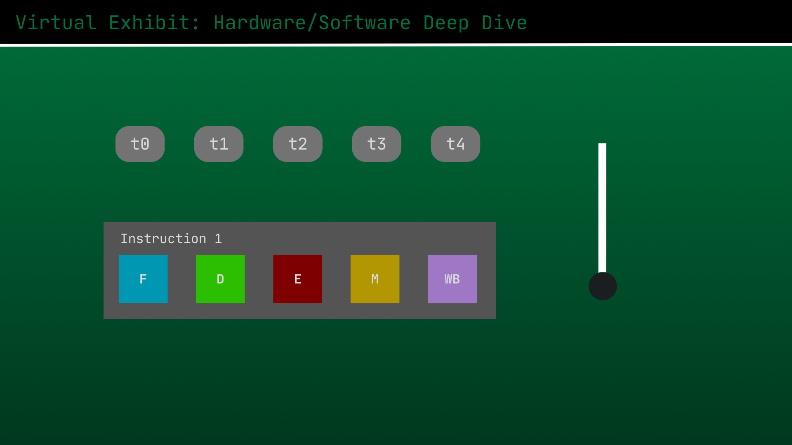
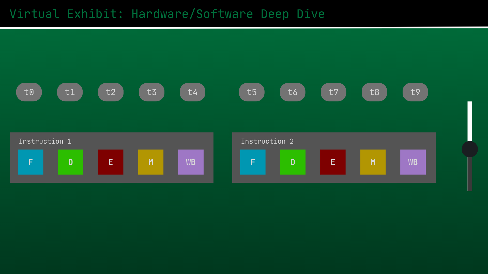
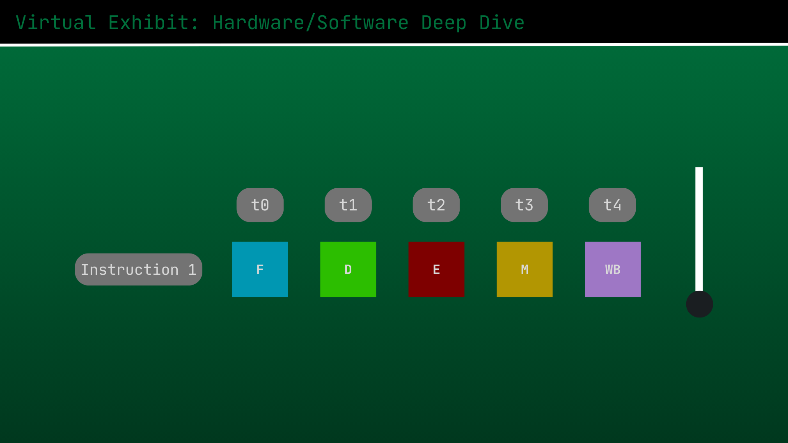
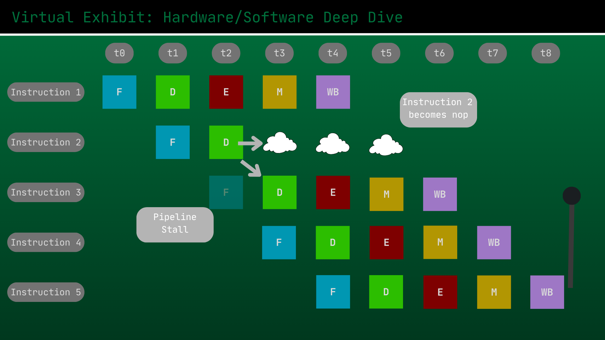

# A Deep Dive into Instruction Level Parallelism - The Foundation of Fast Processors

Group 4 - S01

- HIZON, Allen Conner C.
- INFANTE, Charles Sebastian V.
- MARQUEZ, Jose Miguel S.
- SY, Justin John Abraham F.
- TENORIO, Jeroen Ralph I.

---

## Proposal Revisions

### Previous Feedback

```
Topic disapproved.

1.) Topic should be related to computer architecture.  The proposed topic is a purely a Computer Network topic.

2.) No GitHub submission.  Setup the GitHub.  Proposal documents part of the incremental readme.

Alternative:

*Wifi evolution
*mobile network evolution
```

### Key Changes Made

- **Topic Change:** Previous proposed topic of Password Life Cycle got rejected and changed to Instruction-Level Pipelining
- **Tentative Style Change:** Mockup images changed to be less "slide-like" and focus more on the mockup for the simulation + interactive element (user slider)

## I. Topic Theme

### An in-depth dive into Instruction-Level Parallelism and Pipelining

This topic explores the concept of Instruction-Level Parallelism (ILP) in CPUs, which is one of the core concepts behind making fast processors by allowing them to execute multiple instructions simultaneously. The deep dive starts by explaining ILP and its necessity for CPUs, noting how it is a concept every modern processor is designed around.

The exhibit then focuses on the implementation of **pipelining**, the primary method for achieving ILP in CPUs. Through its interactive simulation of pipelining, the users will be able to visualize instruction execution both before and after pipelining is implemented, enabling them to understand the necessity of the technique. Besides this, the exhibit will also contain simulations for common pipelining hazards – it will show data and branch hazards, along with the techniques used to address them such as pipeline flushes and stalls.

---

**Exhibit Flow**
* **Hero Section**
  * Project Title and Hook
  * Group Member Credits
* **Why Pipelining Exists**
  * Concept: The Sequential Bottleneck
  * Interactive Element: Workload Slider (State 1: Circular Loop Bottleneck)
* **What is Pipelining**
  * Concept: The Factory Assembly Line (5-Stage RISC Architecture)
  * Interactive Element: Workload Slider (State 2: Fully Utilized Parallel Grid)
* **The Danger (Pipeline Hazards)**
  * Concept: Timing Conflicts and Data Dependencies
  * Interactive Element: Step-by-Step Traffic Jam (3-Instruction Cycle Trace)
* **Solutions (Hardware Interventions)**
  * Concept: Interlocking and Data Forwarding (Bypass Circuits)
  * Interactive Element: Permanent Bypass Routing (Live Data Path Visualizer)

---

## II. Interactive Element

The primary interactive element is a live simulation of CPU instruction pipelining. The exhibit initially displays a CPU executing instructions sequentially without pipelining (State 1), demonstrating how the complete fetch, decode, execute, memory, and write-back path must clear for every individual instruction. An interactive workload slider is provided, allowing the user to increase the instruction load to see the immediate sequential bottleneck and resource waste as instructions pile up outside the single execution loop.

The simulation also represents the parallel pipeline layout. The horizontal grid demonstrates visually how instructions execute in parallel across different stages simultaneously. The workload slider remains active, enabling the user to see how the CPU handles the exact same increase in load while maintaining faster execution speeds and peak hardware utilization through parallel processing.

The simulation then features a cycle-by-cycle tracing mode for a specific data hazard scenario. The animation tracks the exact moment a dependent instruction checks the registers, triggers a data hazard alert, and forces the hardware to inject empty stall bubbles. This automated cycle progression explicitly visualizes the timing penalty and traffic jam that freezes all subsequent downstream instructions. The simulation concludes by allowing the user to engage a data forwarding bus via an architectural toggle, visually routing fixed bypass paths across the stages so they can watch data flow directly from the ALU output back into the execution stage in real-time, completely clearing the stalls to restore 100% execution efficiency.

## IV. Tech Stack Plan

| Component | Technology | Application & Justification |
| :---- | :---- | :---- |
| Runtime | Node.js | Running Astro and building tools. |
| Framework | Astro 6 | Main framework for building the virtual exhibit website. |
| Content | MDX | Allows writing content in Markdown while embedding interactive React components directly into the text. |
| UI Components | React & TypeScript | Manages the complex, dynamic state of the interactive branch prediction simulator. |
| Styling | Tailwind CSS | Handles mobile-responsive UI and hardware-themed styling via utility classes. |

## V. Tentative Style

| Design Component | Design Specification & Details |
| :--- | :--- |
| **Theme Name** | **Digital Retro / Legacy BVT32 BIOS** |
| **Color Palette** | <ul><li>`#03071E` (Darkest BIOS Navy)</li><li>`#0A1128` (Deep Terminal Blue)</li><li>`#FFFF55` (Bright Yellow)</li><li>`#FFFFFF` (Crisp White)</li><li>`#FF5555` (Flashing Red)</li><li>`#55FFFF` (Neon Cyan)</li></ul> |
| **Typography** | <ul><li>**Headings:** `VT323` or `Share Tech Mono`</li><li>**Body & Terminals:** `Courier New` or standard monospace text</li></ul> |

### Mobile-responsive layout

The website will be usable and responsive on mobile devices due to the lack of advanced features that would necessitate a desktop device. There will be no intensive calculations on the client side, and the layout of the simulation and controls can easily be adjusted to accommodate for mobile devices given the chosen technologies like Tailwind CSS and React.

---




These two mockup images illustrate the simulation of instruction execution without pipelining. The slider adjusts the number of instructions, and the simulation would display the corresponding time it takes to execute all instructions one after the other.  



These two mockup images illustrate the simulation of instruction execution with pipelining. The slider still adjusts the number of instructions, and the simulation would display how the CPU executes pipelined instructions much faster in parallel.


These two mockup images illustrate the CPU’s handling of a branch misprediction scenario through a pipeline flush. The user would be able to simulate a branch misprediction and view how the corresponding flush causes the remaining instructions to be cleared out.  



The last mockup image shows a simulation of the CPU performing a pipeline stall in order to avoid a data hazard when an instruction is dependent on a previous one. The user is able to choose where the simulated data hazard happens and is able to see the corresponding pipeline stall that enables the operation to complete before the dependent instruction is executed.
